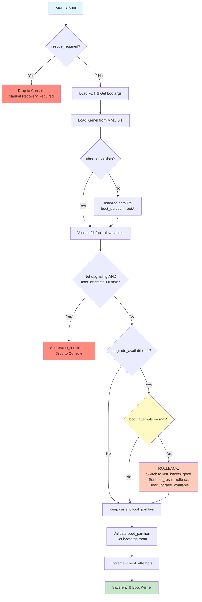

# U-Boot Boot Script for A/B Updates

## Overview

This U-Boot script (`boot.cmd.in`) implements the A/B partition boot logic with automatic rollback capability for Raspberry Pi devices. It manages which root filesystem partition to boot from and handles failure recovery by tracking boot attempts.

## Purpose

The script provides:
1. **A/B Partition Selection**: Chooses between rootA (partition 2) or rootB (partition 3)
2. **Boot Attempt Tracking**: Counts failed boot attempts (max 3)
3. **Automatic Rollback**: Switches to alternate partition after 3 failed attempts
4. **Kernel Loading**: Loads kernel and device tree from boot partition
5. **Boot Arguments**: Sets proper root filesystem for the selected partition

## Boot Flow



## Detailed Boot Logic

### Phase 1: Initialization
```
┌─────────────────────────────────────────┐
│ 1. Load Device Tree (FDT)              │
│ 2. Load Kernel Image                   │
│ 3. Ensure U-Boot Environment Exists    │
└─────────────────────────────────────────┘
```

### Phase 2: Partition Selection
```
┌─────────────────────────────────────────┐
│ IF boot_partition is NOT set:          │
│   → Default to rootA                   │
│                                         │
│ IF boot_partition IS set:              │
│   → Check if upgrade is pending        │
│   → Check boot attempt count           │
│   → Decide: keep or switch partition   │
└─────────────────────────────────────────┘
```

### Phase 3: Rollback Decision
```
┌─────────────────────────────────────────────────┐
│ IF upgrade_available=1 AND                      │
│    boot_attempts >= max_boot_attempts:           │
│                                                   │
│   → Switch to last_known_good_partition          │
│   → Reset boot_attempts=0                        │
│   → Set boot_result=rollback, rollback_occurred=1│
│   → Clear upgrade_available=0                    │
│                                                   │
│ ELSE:                                             │
│   Keep current boot_partition                    │
└─────────────────────────────────────────────────┘
```

## U-Boot Commands Explained

### `fdt addr ${fdt_addr} && fdt get value bootargs /chosen bootargs`
**Purpose**: Load and parse the Flattened Device Tree (FDT)

- `fdt addr ${fdt_addr}`: Set the FDT memory address to the location where firmware loaded it
- `fdt get value bootargs /chosen bootargs`: Extract the `bootargs` property from the `/chosen` node in the device tree
- The `&&` ensures the second command only runs if the first succeeds

**Why**: The device tree contains hardware configuration and initial boot parameters. We need to read the existing bootargs before modifying them.

**Example**: Extracts something like `console=serial0,115200 console=tty1 root=/dev/mmcblk0p2 rootfstype=ext4`

---

### `fatload mmc 0:1 ${kernel_addr_r} @@KERNEL_IMAGETYPE@@`
**Purpose**: Load the Linux kernel image from the boot partition into RAM

- `fatload`: Load file from FAT filesystem
- `mmc 0:1`: Device 0 (SD card), partition 1 (boot partition)
- `${kernel_addr_r}`: RAM address to load kernel (defined by U-Boot)
- `@@KERNEL_IMAGETYPE@@`: Placeholder replaced at build time (e.g., `Image` for ARM64)

**Why**: The kernel must be loaded into RAM before it can be executed.

**Example**: `fatload mmc 0:1 0x00080000 Image` loads the kernel to address 0x00080000

---

### `if test ! -e @@BOOT_MEDIA@@ 0:1 uboot.env; then saveenv; fi;`
**Purpose**: Create U-Boot environment file if it doesn't exist

- `test ! -e @@BOOT_MEDIA@@ 0:1 uboot.env`: Check if file exists on boot partition
- `@@BOOT_MEDIA@@`: Placeholder for boot media type (e.g., `mmc`)
- `saveenv`: Write current U-Boot environment variables to `uboot.env`

**Why**: First boot needs to persist U-Boot variables (rpipart, boot_attempts) to survive reboots.

**Location**: Creates `/boot/uboot.env` on the FAT32 boot partition

---

### `if env exists boot_partition; then` (and variable defaulting)
**Purpose**: Check if required variables exist and set defaults for missing ones

- After first-boot initialization, the script validates every required variable
- Missing or empty variables get safe defaults (boot_partition→rootA, boot_attempts→0, etc.)
- This handles partial/corrupt environments gracefully

**Why**: A corrupted uboot.env might have some variables but not others. Individual defaulting ensures the system can always boot.

---

### `if test "${upgrade_available}" = "1"; then`
**Purpose**: Check if an update was recently applied

- `upgrade_available`: Flag set by yocto-a-b-update.sh after installing an update
- Value `1` means "update applied, testing new partition"
- Value `0` means "no recent update" or "update confirmed successful"

**Why**: We only track boot attempts and perform rollback if we're testing a newly updated partition.

**Set by**: ADU agent (via yocto-a-b-update.sh) with `fw_setenv upgrade_available 1` before reboot
**Cleared by**: Boot validation service via `fw_setenv upgrade_available 0` after successful boot

---

### `if test "${boot_attempts}" -ge "${max_boot_attempts}"; then`
**Purpose**: Check if maximum boot attempts reached

- `boot_attempts`: Counter tracking failed boot attempts on current partition
- Value `>= max_boot_attempts` (default 5) triggers rollback to alternate partition
- Reset to `0` after successful boot or rollback

**Why**: After 5 consecutive failed boots, assume the partition is broken and revert to the known-good partition.

---

### Rollback Logic: `if test "${boot_partition}" = "rootA"; then`
**Purpose**: Determine which partition is active and switch to the other

**Case 1: Currently on rootA**
```bash
setenv boot_partition rootB       # Switch to rootB (or use last_known_good_partition)
setenv boot_attempts 0            # Reset counter
setenv boot_result rollback       # Mark as rollback
```

**Case 2: Currently on rootB**
```bash
setenv boot_partition rootA       # Switch to rootA (or use last_known_good_partition)
setenv boot_attempts 0            # Reset counter
setenv boot_result rollback       # Mark as rollback
```

**Why**: Rollback means "go back to the partition we were using before the update."

---

### `setenv bootargs "${bootargs} root=/dev/mmcblk0p2"` (or `p3`)
**Purpose**: Append root filesystem partition to kernel boot arguments

- Takes existing `bootargs` from device tree
- Appends `root=/dev/mmcblk0pN` based on `boot_partition`
- `boot_partition=rootA` → `root=/dev/mmcblk0p2`
- `boot_partition=rootB` → `root=/dev/mmcblk0p3`
- Invalid values are rejected with fallback to `last_known_good_partition` or `rootA`

**Why**: The Linux kernel needs to know where to find the root filesystem.

---

### `setexpr boot_attempts ${boot_attempts} + 1`
**Purpose**: Increment the boot attempt counter

- Adds 1 to the current value of `boot_attempts`
- Will be used on next reboot to check for failure threshold
- U-Boot automatically persists this to `uboot.env`

**Why**: Track how many times we've tried to boot the current partition. After max_boot_attempts (default 5) with no success signal from the OS, rollback triggers.

**Note**: The boot validation service (adu-boot-validation.sh) resets this to 0 on ALL successful boots — both normal and upgrade.

---

### `@@KERNEL_BOOTCMD@@ ${kernel_addr_r} - ${fdt_addr}`
**Purpose**: Execute the kernel and start Linux boot

- `@@KERNEL_BOOTCMD@@`: Placeholder replaced at build time with boot command
  - ARM64: `booti` (boot Image format)
  - ARM32: `bootz` (boot zImage format)
- `${kernel_addr_r}`: RAM address where kernel was loaded
- `-`: No separate initramfs (initramfs is built into kernel if needed)
- `${fdt_addr}`: RAM address where device tree is located

**Why**: This is the final step that hands control from U-Boot to the Linux kernel.

**Example**: `booti 0x00080000 - 0x02600000` boots the kernel with the device tree

## Variables Reference

### U-Boot Environment Variables

| Variable | Type | Purpose | Set By | Example Values |
|----------|------|---------|--------|----------------|
| `boot_partition` | Persistent | Current active partition name | SWUpdate / U-Boot | `rootA`, `rootB` |
| `boot_attempts` | Persistent | Failed boot counter for current partition | U-Boot (auto-increment) | `0`, `1`, `2`, `3`, `4`, `5` |
| `upgrade_available` | Persistent | Flag indicating recent update applied | ADU agent / Boot health service | `0` (no update), `1` (testing update) |
| `max_boot_attempts` | Persistent | Rollback threshold (default 5) | First boot init / Operator | `5` |
| `last_known_good_partition` | Persistent | Last validated partition | Boot validation service | `rootA`, `rootB` |
| `boot_result` | Persistent | Result of last boot validation | Boot validation service / U-Boot | `success`, `failed`, `unknown`, `rollback` |
| `rescue_required` | Persistent | Rescue latch for catastrophic failure | U-Boot | `0` (normal), `1` (requires manual recovery) |
| `rollback_occurred` | Persistent | Flag indicating U-Boot auto-rollback | U-Boot | `0`, `1` |
| `rollback_failed_partition` | Persistent | Which partition failed during rollback | U-Boot | `rootA`, `rootB` |
| `fdt_addr` | Runtime | Device tree memory address | Firmware | `0x02600000` |
| `kernel_addr_r` | Runtime | Kernel load address | U-Boot config | `0x00080000` |
| `bootargs` | Runtime | Kernel command line arguments | Device tree / U-Boot | `console=serial0,115200 root=/dev/mmcblk0p2` |

### Build-Time Placeholders

| Placeholder | Replaced With | Example | Description |
|-------------|---------------|---------|-------------|
| `@@KERNEL_IMAGETYPE@@` | Kernel image filename | `Image` | ARM64 kernel image name |
| `@@BOOT_MEDIA@@` | Boot device type | `mmc` | Storage device type (mmc, usb, etc.) |
| `@@KERNEL_BOOTCMD@@` | Boot command | `booti` | Architecture-specific boot command |

## Boot Scenarios

### Scenario 1: First Boot (Fresh Install)
```
1. boot_partition: NOT SET → Defaults to rootA
2. boot_attempts: NOT SET → Defaults to 0
3. upgrade_available: NOT SET → Defaults to 0
4. rescue_required: NOT SET → Defaults to 0
5. Result: Boots from default partition (rootA)
6. uboot.env file created on boot partition with all defaults
```

### Scenario 2: Normal Boot (No Updates)
```
1. boot_partition: rootA
2. boot_attempts: 0
3. upgrade_available: 0
4. Result: Boots from rootA
5. boot_attempts incremented to 1 by U-Boot
6. Boot validation service resets boot_attempts to 0 and sets boot_result=success
```

### Scenario 3: After Update Applied
```
Initial state:
  - Currently running rootA (boot_partition=rootA, boot_attempts=0)

Update process:
  1. ADU downloads update to /adu/
  2. SWUpdate installs update to rootB (partition 3)
  3. yocto-a-b-update.sh writes swupdate_state.json with:
     - update_phase=applied_pending_validation
     - target_partition=rootB, workflow_id=<id>
  4. yocto-a-b-update.sh sets: boot_partition=rootB, upgrade_available=1, boot_attempts=0
  5. Device reboots

U-Boot boot logic:
  - boot_partition=rootB
  - upgrade_available=1
  - boot_attempts=0 → incremented to 1
  - Sets bootargs: root=/dev/mmcblk0p3
  - Boots: Linux from rootB

Boot validation service:
  Phase 1: Checks actual partition matches target (from state.json)
  Phase 2: Runs health checks
  - If OK: boot_result=success, upgrade_available=0, boot_attempts=0
  - If FAIL: boot_result=failed → triggers reboot for retry
```

### Scenario 4: Failed Update (Automatic Rollback)
```
State after 5 failed boot attempts:
  - boot_partition=rootB (broken)
  - boot_attempts=5 (>= max_boot_attempts)
  - upgrade_available=1

U-Boot rollback logic triggers:
  1. Detects: upgrade_available=1 AND boot_attempts >= max_boot_attempts
  2. Sets: boot_result_B=failed, rollback_failed_partition=rootB
  3. Switches: boot_partition=rootA (from last_known_good_partition)
  4. Resets: boot_attempts=0
  5. Sets: boot_result=rollback, rollback_occurred=1
  6. Clears: upgrade_available=0
  7. Saves environment and boots rootA

Boot validation service on rootA:
  Phase 1: Detects rollback_occurred=1
    → Reads swupdate_state.json, blacklists failed workflow
    → Resets boot_attempts=0, clears rollback_occurred
  Result: System reverts to previous working version
          Failed workflow is blacklisted to prevent retry loops
```

### Scenario 5: Catastrophic Failure (Both Partitions Bad)
```
After rootA also fails validation 5 times:
  - boot_partition=rootA (last known good, also broken)
  - boot_attempts=5 (>= max_boot_attempts)
  - upgrade_available=0 (not in upgrade mode)

U-Boot catastrophic check triggers:
  1. Sets: rescue_required=1 (persistent latch)
  2. Saves environment
  3. Drops to U-Boot console

On next power cycle:
  - rescue_required=1 detected immediately
  - Drops to console again (no boot loop!)
  
Operator recovery:
  setenv rescue_required 0
  setenv boot_attempts 0
  saveenv
  reset
```

## Integration with ADU Update Process

### Update Flow with U-Boot Script

```
┌──────────────────────────────────────────────────────────┐
│                    Update Timeline                        │
└──────────────────────────────────────────────────────────┘

Step 1: Pre-Update State
  Current Boot: rootA (boot_partition=rootA)
  Status: Stable (boot_attempts=0, upgrade_available=0)

Step 2: Update Initiated
  ADU Agent downloads update to /adu/
  SWUpdate extracts and installs to rootB

Step 3: Pre-Reboot Setup (by yocto-a-b-update.sh)
  Writes swupdate_state.json (update_phase=applied_pending_validation)
  fw_setenv upgrade_available 1
  fw_setenv boot_attempts 0
  fw_setenv boot_partition rootB

Step 4: First Reboot
  [U-Boot Script]
  - Checks rescue_required (should be 0)
  - Reads: boot_partition=rootB, upgrade_available=1, boot_attempts=0
  - Increments: boot_attempts=1
  - Sets bootargs: root=/dev/mmcblk0p3
  - Boots: Linux from rootB

Step 5: Boot Validation (adu-boot-validation.service)
  Phase 1 - Rollback Detection:
    ✓ Actual partition matches target (from state.json)
    ✓ No partition flapping detected

  Phase 2 - Health Checks:
    ✓ Critical services running
    ✓ Root filesystem mounted rw
    ✓ Disk space sufficient

  On Success:
    fw_setenv boot_result success
    fw_setenv upgrade_available 0
    fw_setenv boot_attempts 0
    fw_setenv last_known_good_partition rootB
    → Update confirmed successful

  On Failure:
    fw_setenv boot_result failed
    → Triggers reboot for retry
    → boot_attempts stays at 1
    → Next boot will be attempt #2

Step 6: Rollback (if 5 failures)
  [U-Boot Script on 6th reboot]
  - Detects: boot_attempts=5 >= max_boot_attempts, upgrade_available=1
  - Switches: boot_partition=rootA (from last_known_good_partition)
  - Sets: boot_result=rollback, rollback_occurred=1
  - Resets: boot_attempts=0, upgrade_available=0
  - Boots: Known-good rootA
  
  [Boot Validation on rootA]
  - Detects rollback_occurred=1
  - Reads swupdate_state.json → blacklists failed workflow
  - Resets state
  - ADU agent will NOT retry the blacklisted workflow
```

## File Locations

- **Boot Script Source**: `recipes-bsp/rpi-u-boot-scr/files/boot.cmd.in`
- **Compiled Boot Script**: `/boot/boot.scr` (on device)
- **U-Boot Environment**: `/boot/uboot.env` (on device)
- **Boot Validation Service**: `recipes-support/adu-boot-validation/`

## U-Boot Environment Tools

### On Device (Runtime)

```bash
# Read U-Boot variables
fw_printenv rpipart
fw_printenv boot_attempts
fw_printenv have_updated

# Set U-Boot variables
fw_setenv rpipart 2
fw_setenv boot_attempts 0
fw_setenv have_updated 1

# Show all variables
fw_printenv
```

### Configuration File
Location: `/etc/fw_env.config`
```
# Device          Offset    Size      Erase Size
/boot/uboot.env   0x0000    0x4000
```

## Troubleshooting

For U-Boot boot issues and recovery procedures, see **[Troubleshooting Guide](troubleshooting.md#u-boot-ab-partition-issues)**.

Quick reference:
```bash
# Check current boot state
fw_printenv boot_partition boot_attempts upgrade_available boot_result rescue_required

# Force recovery to rootA
fw_setenv boot_partition rootA
fw_setenv upgrade_available 0
fw_setenv boot_attempts 0
fw_setenv rescue_required 0
reboot
```

## References

- [U-Boot Documentation](https://u-boot.readthedocs.io/)
- [Raspberry Pi U-Boot](https://github.com/u-boot/u-boot/tree/master/board/raspberrypi)
