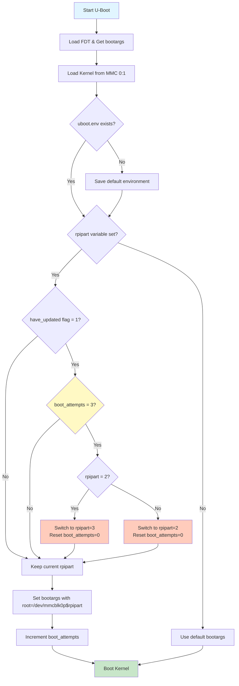

# U-Boot Boot Script for A/B Updates

## Overview

This U-Boot script (`boot.cmd.in`) implements the A/B partition boot logic with automatic rollback capability for Raspberry Pi devices. It manages which root filesystem partition to boot from and handles failure recovery by tracking boot attempts.

## Purpose

The script provides:
1. **A/B Partition Selection**: Chooses between rootA (partition 2) or rootB (partition 3)
2. **Boot Attempt Tracking**: Counts failed boot attempts (max 3)
3. **Automatic Rollback**: Switches to alternate partition after 3 failed attempts
4. **Kernel Loading**: Loads kernel and device tree from boot partition
5. **Boot Arguments**: Sets proper root filesystem for the selected partition

## Boot Flow



## Detailed Boot Logic

### Phase 1: Initialization
```
┌─────────────────────────────────────────┐
│ 1. Load Device Tree (FDT)              │
│ 2. Load Kernel Image                   │
│ 3. Ensure U-Boot Environment Exists    │
└─────────────────────────────────────────┘
```

### Phase 2: Partition Selection
```
┌─────────────────────────────────────────┐
│ IF rpipart is NOT set:                 │
│   → Use default partition (from DT)    │
│                                         │
│ IF rpipart IS set:                     │
│   → Check if update was applied        │
│   → Check boot attempt count           │
│   → Decide: keep or switch partition   │
└─────────────────────────────────────────┘
```

### Phase 3: Rollback Decision
```
┌─────────────────────────────────────────┐
│ IF have_updated=1 AND boot_attempts=3: │
│                                         │
│   rpipart=2 → Switch to 3              │
│   rpipart=3 → Switch to 2              │
│   Reset boot_attempts=0                │
│                                         │
│ ELSE:                                   │
│   Keep current rpipart                 │
└─────────────────────────────────────────┘
```

## U-Boot Commands Explained

### `fdt addr ${fdt_addr} && fdt get value bootargs /chosen bootargs`
**Purpose**: Load and parse the Flattened Device Tree (FDT)

- `fdt addr ${fdt_addr}`: Set the FDT memory address to the location where firmware loaded it
- `fdt get value bootargs /chosen bootargs`: Extract the `bootargs` property from the `/chosen` node in the device tree
- The `&&` ensures the second command only runs if the first succeeds

**Why**: The device tree contains hardware configuration and initial boot parameters. We need to read the existing bootargs before modifying them.

**Example**: Extracts something like `console=serial0,115200 console=tty1 root=/dev/mmcblk0p2 rootfstype=ext4`

---

### `fatload mmc 0:1 ${kernel_addr_r} @@KERNEL_IMAGETYPE@@`
**Purpose**: Load the Linux kernel image from the boot partition into RAM

- `fatload`: Load file from FAT filesystem
- `mmc 0:1`: Device 0 (SD card), partition 1 (boot partition)
- `${kernel_addr_r}`: RAM address to load kernel (defined by U-Boot)
- `@@KERNEL_IMAGETYPE@@`: Placeholder replaced at build time (e.g., `Image` for ARM64)

**Why**: The kernel must be loaded into RAM before it can be executed.

**Example**: `fatload mmc 0:1 0x00080000 Image` loads the kernel to address 0x00080000

---

### `if test ! -e @@BOOT_MEDIA@@ 0:1 uboot.env; then saveenv; fi;`
**Purpose**: Create U-Boot environment file if it doesn't exist

- `test ! -e @@BOOT_MEDIA@@ 0:1 uboot.env`: Check if file exists on boot partition
- `@@BOOT_MEDIA@@`: Placeholder for boot media type (e.g., `mmc`)
- `saveenv`: Write current U-Boot environment variables to `uboot.env`

**Why**: First boot needs to persist U-Boot variables (rpipart, boot_attempts) to survive reboots.

**Location**: Creates `/boot/uboot.env` on the FAT32 boot partition

---

### `if env exists rpipart; then`
**Purpose**: Check if the `rpipart` variable is defined

- `env exists rpipart`: Returns true if the variable exists in U-Boot environment
- If false, skip A/B logic and use default boot

**Why**: On first boot, `rpipart` won't be set yet. This allows graceful fallback to default boot behavior.

---

### `if test "${have_updated}" = 1; then`
**Purpose**: Check if an update was recently applied

- `have_updated`: Flag set by SWUpdate after installing an update
- Value `1` means "update applied, testing new partition"
- Value `0` means "no recent update" or "update confirmed successful"

**Why**: We only track boot attempts and perform rollback if we're testing a newly updated partition.

**Set by**: ADU agent via `fw_setenv have_updated 1` before reboot
**Cleared by**: Boot health service via `fw_setenv have_updated 0` after successful boot

---

### `if test "${boot_attempts}" = "3"; then`
**Purpose**: Check if maximum boot attempts reached

- `boot_attempts`: Counter tracking failed boot attempts on current partition
- Value `3` triggers rollback to alternate partition
- Reset to `0` after successful boot or rollback

**Why**: After 3 consecutive failed boots, assume the partition is broken and revert to the known-good partition.

---

### Rollback Logic: `if test "${rpipart}" = "2"; then`
**Purpose**: Determine which partition is active and switch to the other

**Case 1: Currently on rootA (partition 2)**
```bash
setenv rpipart 3          # Switch to rootB
setenv boot_attempts 0    # Reset counter
```

**Case 2: Currently on rootB (partition 3)**
```bash
setenv rpipart 2          # Switch to rootA
setenv boot_attempts 0    # Reset counter
```

**Why**: Rollback means "go back to the partition we were using before the update."

---

### `setenv bootargs "${bootargs} root=/dev/mmcblk0p${rpipart}"`
**Purpose**: Append root filesystem partition to kernel boot arguments

- Takes existing `bootargs` from device tree
- Appends `root=/dev/mmcblk0p${rpipart}` to specify which partition contains the root filesystem
- `${rpipart}` expands to `2` (rootA) or `3` (rootB)

**Example Results**:
- If `rpipart=2`: `root=/dev/mmcblk0p2` → boots rootA
- If `rpipart=3`: `root=/dev/mmcblk0p3` → boots rootB

**Why**: The Linux kernel needs to know where to find the root filesystem. This is how we tell it to boot from rootA or rootB.

---

### `setenv boot_attempts boot_attempts + 1`
**Purpose**: Increment the boot attempt counter

- Adds 1 to the current value of `boot_attempts`
- Will be used on next reboot to check for failure threshold
- U-Boot automatically persists this to `uboot.env`

**Why**: Track how many times we've tried to boot the current partition. After 3 attempts with no success signal from the OS, we assume failure.

**Note**: The boot validation service (adu-boot-validation.sh) resets this to 0 on successful boot via `fw_setenv boot_attempts 0`.

---

### `@@KERNEL_BOOTCMD@@ ${kernel_addr_r} - ${fdt_addr}`
**Purpose**: Execute the kernel and start Linux boot

- `@@KERNEL_BOOTCMD@@`: Placeholder replaced at build time with boot command
  - ARM64: `booti` (boot Image format)
  - ARM32: `bootz` (boot zImage format)
- `${kernel_addr_r}`: RAM address where kernel was loaded
- `-`: No separate initramfs (initramfs is built into kernel if needed)
- `${fdt_addr}`: RAM address where device tree is located

**Why**: This is the final step that hands control from U-Boot to the Linux kernel.

**Example**: `booti 0x00080000 - 0x02600000` boots the kernel with the device tree

## Variables Reference

### U-Boot Environment Variables

| Variable | Type | Purpose | Set By | Example Values |
|----------|------|---------|--------|----------------|
| `rpipart` | Persistent | Current active partition number | SWUpdate / U-Boot | `2` (rootA), `3` (rootB) |
| `boot_attempts` | Persistent | Failed boot counter for current partition | U-Boot (auto-increment) | `0`, `1`, `2`, `3` |
| `have_updated` | Persistent | Flag indicating recent update applied | ADU agent / Boot health service | `0` (no update), `1` (testing update) |
| `fdt_addr` | Runtime | Device tree memory address | Firmware | `0x02600000` |
| `kernel_addr_r` | Runtime | Kernel load address | U-Boot config | `0x00080000` |
| `bootargs` | Runtime | Kernel command line arguments | Device tree / U-Boot | `console=serial0,115200 root=/dev/mmcblk0p2` |

### Build-Time Placeholders

| Placeholder | Replaced With | Example | Description |
|-------------|---------------|---------|-------------|
| `@@KERNEL_IMAGETYPE@@` | Kernel image filename | `Image` | ARM64 kernel image name |
| `@@BOOT_MEDIA@@` | Boot device type | `mmc` | Storage device type (mmc, usb, etc.) |
| `@@KERNEL_BOOTCMD@@` | Boot command | `booti` | Architecture-specific boot command |

## Boot Scenarios

### Scenario 1: First Boot (Fresh Install)
```
1. rpipart: NOT SET → Use default partition from device tree
2. boot_attempts: NOT SET
3. have_updated: NOT SET
4. Result: Boots from default partition (usually P2/rootA)
5. uboot.env file created on boot partition
```

### Scenario 2: Normal Boot (No Updates)
```
1. rpipart: 2
2. boot_attempts: 0
3. have_updated: 0
4. Result: Boots from rootA (partition 2)
5. boot_attempts incremented to 1
6. Boot health service resets boot_attempts to 0 on success
```

### Scenario 3: After Update Applied
```
Initial state:
  - Currently running rootA (rpipart=2, boot_attempts=0)

Update process:
  1. ADU downloads update to /adu/
  2. SWUpdate installs update to rootB (partition 3)
  3. SWUpdate sets: rpipart=3, have_updated=1
  4. Device reboots

U-Boot boot logic:
  - rpipart=3 (rootB)
  - have_updated=1
  - boot_attempts=0 → incremented to 1
  - Boots from rootB

Boot health service:
  - Validates system health
  - If OK: fw_setenv boot_attempts 0, fw_setenv have_updated 0
  - If FAIL: exits with error, boot_attempts stays at 1
```

### Scenario 4: Failed Update (Automatic Rollback)
```
State after 3 failed boot attempts:
  - rpipart=3 (rootB - broken)
  - boot_attempts=3
  - have_updated=1

U-Boot rollback logic triggers:
  1. Detects: have_updated=1 AND boot_attempts=3
  2. Switches: rpipart=2 (back to rootA)
  3. Resets: boot_attempts=0
  4. Saves environment
  5. Boots from rootA (known-good partition)

Result: System reverts to previous working version automatically
```

### Scenario 5: Partial Failure (Second Attempt)
```
1st boot attempt:
  - rpipart=3, boot_attempts=1
  - Boot health fails (e.g., network down)
  - Device reboots

2nd boot attempt:
  - rpipart=3 (unchanged)
  - boot_attempts=1 → incremented to 2
  - If boot health succeeds: resets to 0
  - If boot health fails again: stays at 2

3rd boot attempt (if 2nd fails):
  - rpipart=3
  - boot_attempts=2 → incremented to 3
  - If fails: next reboot triggers rollback
```

## Integration with ADU Update Process

### Update Flow with U-Boot Script

```
┌──────────────────────────────────────────────────────────┐
│                    Update Timeline                        │
└──────────────────────────────────────────────────────────┘

Step 1: Pre-Update State
  Current Boot: rootA (rpipart=2)
  Status: Stable (boot_attempts=0, have_updated=0)

Step 2: Update Initiated
  ADU Agent downloads update to /adu/
  SWUpdate extracts and installs to rootB

Step 3: Pre-Reboot Setup (by SWUpdate)
  fw_setenv rpipart 3
  fw_setenv have_updated 1
  fw_setenv boot_attempts 0

Step 4: First Reboot
  [U-Boot Script]
  - Reads: rpipart=3, have_updated=1, boot_attempts=0
  - Increments: boot_attempts=1
  - Sets bootargs: root=/dev/mmcblk0p3
  - Boots: Linux from rootB

Step 5: Boot Health Check (adu-boot-validation.service)
  Validates:
    ✓ Critical services running
    ✓ Root filesystem mounted rw
    ✓ /adu partition accessible
    ✓ Network available
    ✓ Disk space sufficient

  On Success:
    fw_setenv boot_attempts 0
    fw_setenv have_updated 0
    → Update confirmed successful

  On Failure:
    Exit with error
    → boot_attempts stays at 1
    → System will reboot and retry

Step 6: Rollback (if 3 failures)
  [U-Boot Script on 4th reboot]
  - Detects: boot_attempts=3, have_updated=1
  - Switches: rpipart=2 (back to rootA)
  - Resets: boot_attempts=0
  - Boots: Known-good rootA
```

## File Locations

- **Boot Script Source**: `recipes-bsp/rpi-u-boot-scr/files/boot.cmd.in`
- **Compiled Boot Script**: `/boot/boot.scr` (on device)
- **U-Boot Environment**: `/boot/uboot.env` (on device)
- **Boot Validation Service**: `recipes-support/adu-boot-validation/`

## U-Boot Environment Tools

### On Device (Runtime)

```bash
# Read U-Boot variables
fw_printenv rpipart
fw_printenv boot_attempts
fw_printenv have_updated

# Set U-Boot variables
fw_setenv rpipart 2
fw_setenv boot_attempts 0
fw_setenv have_updated 1

# Show all variables
fw_printenv
```

### Configuration File
Location: `/etc/fw_env.config`
```
# Device          Offset    Size      Erase Size
/boot/uboot.env   0x0000    0x4000
```

## Troubleshooting

For U-Boot boot issues and recovery procedures, see **[Troubleshooting Guide](troubleshooting.md#u-boot-ab-partition-issues)**.

Quick reference:
```bash
# Check current boot state
fw_printenv boot_partition boot_attempts upgrade_available

# Force recovery to rootA
fw_setenv boot_partition rootA
fw_setenv upgrade_available 0
fw_setenv boot_attempts 0
reboot
```

## References

- [U-Boot Documentation](https://u-boot.readthedocs.io/)
- [Raspberry Pi U-Boot](https://github.com/u-boot/u-boot/tree/master/board/raspberrypi)
